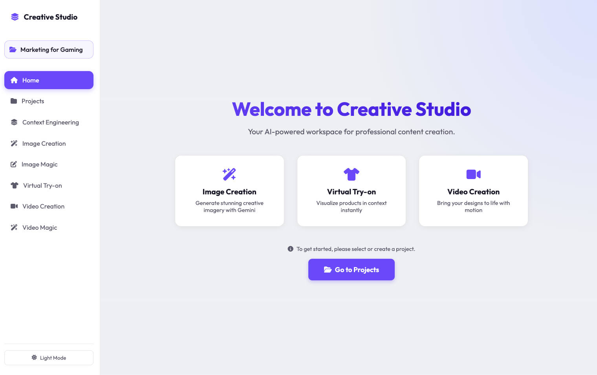

# Creative Studio

Creative Studio is a high-performance web application designed for professional content creation. It leverages Google's state-of-the-art AI models (Gemini 3, Gemini 2.5, Veo) to provide a seamless, high-speed workflow for asset generation, editing, and brand management.



## Key Features

### 1. Project Management & Context Engineering
-   **Intelligent Projects**: Organize creative work into smart projects.
-   **Context Engineering**: Define the specific "DNA" of a brand and project.
    -   **Brand Core & Project Specifics**: Multi-layer context management for consistent aesthetics.
    -   **Context Versions**: Version control for brand guidelines and project metadata.
    -   **AI Prompt Synthesis**: Automatically generate production-ready prompts from high-level context.

### 2. High-Fidelity Image Creation
-   **Dual-Model Pipeline**:
    -   **Gemini 3 Pro Image**: High-fidelity, production-quality generation.
    -   **Gemini 2.5 Flash Image**: Ultra-fast generation for rapid iteration.
-   **Reference-Guided Generation**: Use **Style**, **Product**, and **Scene** images to strictly control the AI output.
-   **Asset Metadata**: Every saved asset captures its full generating prompt, model version, and exact context state for perfect reproducability.

### 3. Image Magic (In-Painting & Editing)
-   **Natural Language Editing**: Modify images using conversational instructions.
-   **Context-Aware Modifications**: Edits automatically respect the project's brand guidelines (lighting, vibe, etc.).

### 4. Video Magic & Veo Integration
-   **Cinematic Video Creation**: Generate short, high-quality video clips using Google's Veo.
-   **Video In-filling**: Create smooth transitions between first and last frames.
-   **Video Extension**: Extend existing clips while maintaining visual consistency.

### 5. Performance & Architecture
-   **Ultra-Fast Loading**: Optimized backend uses parallel GCS signed URL generation and lazy-loading of assets.
-   **Modular Frontend**: Built with modern ES6 modules for high maintainability.
-   **Persistent State**: Remembers your active tab and project session across reloads.

## Tech Stack

-   **Frontend**: Vanilla JavaScript (ES6 Modules), HTML5, CSS3.
-   **Backend**: Python, FastAPI, SQLAlchemy (SQLite).
-   **AI Services**: Google Vertex AI / GenAI (Gemini 3, Gemini 2.5 Pro/Flash, Veo).
-   **Storage**: Google Cloud Storage (GCS) for high-performance asset serving.

## Setup

1.  **Clone the repository**
2.  **Create a virtual environment**
    ```bash
    python3 -m venv venv
    source venv/bin/activate
    ```
3.  **Install dependencies**
    ```bash
    pip install -r requirements.txt
    ```
4.  **Environment Variables**
    Create a `.env` file in the root directory:
    ```env
    GOOGLE_API_KEY=your_api_key_here
    GCS_BUCKET_NAME=your_gcs_bucket_name
    GOOGLE_CLOUD_PROJECT=your_project_id
    GOOGLE_APPLICATION_CREDENTIALS=/path/to/your/service-account.json
    ```
5.  **Google Cloud Authentication**
    ```bash
    gcloud auth application-default login
    ```

## Running Locally

```bash
uvicorn backend.main:app --reload --port 8888
```
Access the app at `http://localhost:8888`.

## Documentation
-   [Architecture Overview](ARCHITECTURE.md)
-   [Code Review & Recommendations](CODE_REVIEW.md)
-   [Build & Deploy](build_and_deploy.sh)
